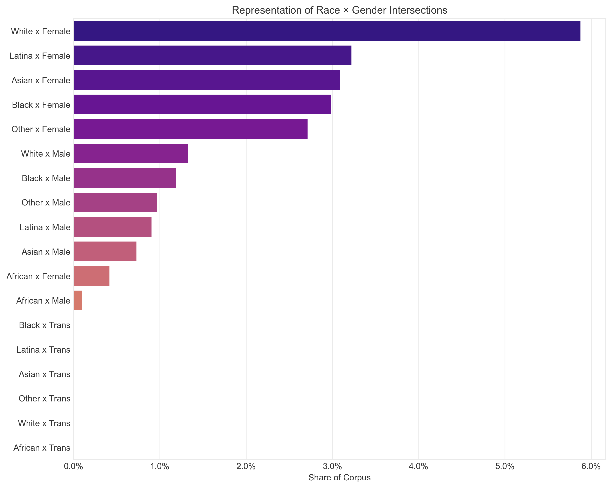
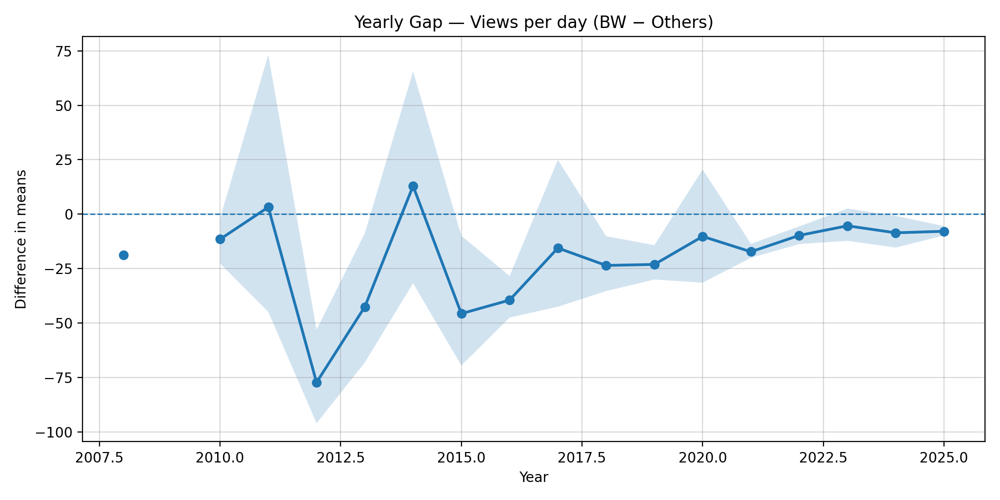
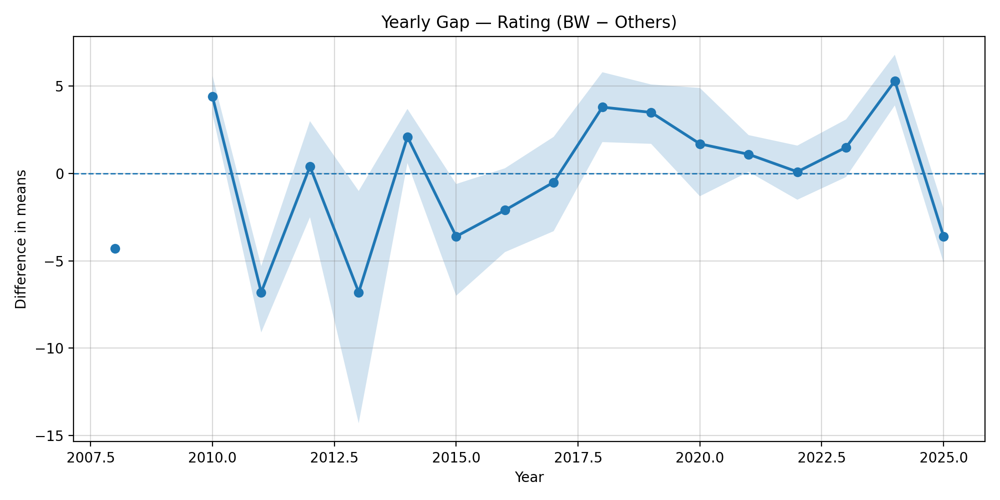
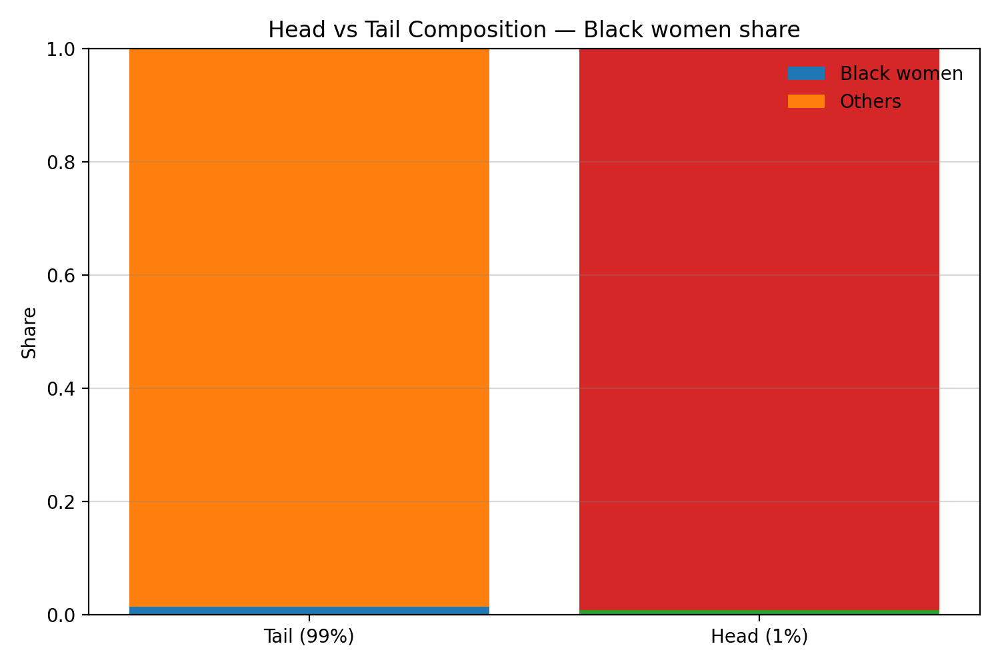
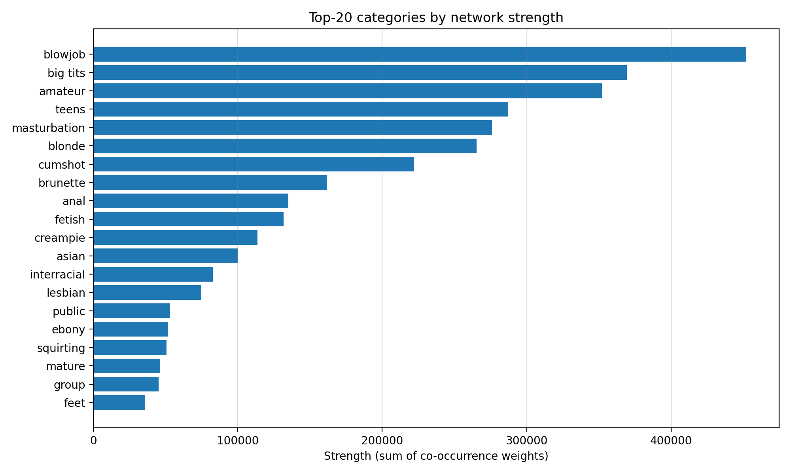
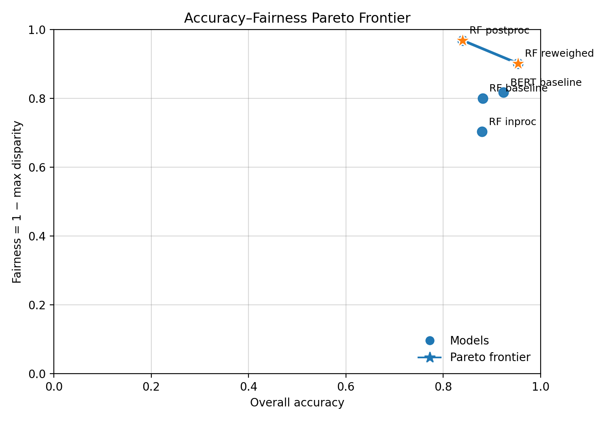

<div align="center">
  <h1 style="border-bottom: none;">AlgoFairness Pornometrics</h1>
  <h3>Fair Machine Learning for User-Generated Adult Video Platforms</h3>
  <p><strong>MSc Dissertation Project | University of Essex</strong></p>
</div>

<div align="center">
  &nbsp;
  &nbsp;
  
</div>

---

## 📖 Abstract

This repository presents a complete and reproducible research pipeline for auditing algorithmic bias on user-generated adult video platforms. The project focuses on **intersectional discrimination**, providing quantitative evidence of how recommendation systems systematically disadvantage Black, Latina, and Asian women through compounding classification bias, temporal economic harm, and metadata-embedded linguistic harm.

The corpus comprises **535,236 videos across 111 categories and 52 features**. The Random Forest baseline (accuracy: 87.8%, F1: 0.758) reveals substantial Equal Opportunity Differences: Black Women (EOD: 0.196, recall: 0.562 vs. 0.758 for White Women) and Latina Women (EOD: 0.200, recall: 0.558) face the steepest classification disadvantage. Beyond model performance, the analysis documents that Black Women's content ratings are declining significantly faster than the corpus average (slope gap: −3.38/year, bootstrap 95% CI [−3.75, −2.98]) and identifies racial occupational pipeline segregation in the platform's amateur content economy.

Six mitigation strategies are compared using **Pareto analysis** on two objectives (accuracy × fairness). Only two strategies are non-dominated: **post-processing ThresholdOptimizer** (accuracy: 0.839, near-exact parity — max EOD 0.027 across all groups) and **pre-processing reweighing** (accuracy: 0.953, Black Women EOD reduced from 0.196 to 0.092 — a 53% reduction). Critically, adversarial debiasing was dominated on both objectives and *worsened* outcomes for Asian Women (EOD: 0.109 → 0.283, from original thesis run) because their content vocabulary constitutes the classification signal itself — a feature representation problem that reweighting cannot solve. DistilBERT (accuracy: 0.924, F1: 0.868) substantially reduces the Black Women recall gap (EOD: 0.196 → 0.080) but is dominated in Pareto space by both non-dominated strategies. This work provides a fully reproducible framework for auditing, measuring, and mitigating intersectional algorithmic harm in content platforms.

---

## Why This Research Exists

Adult content platforms are among the largest and least-studied sites of algorithmic labour in the digital economy. The workers whose content they host are not employees; they are independent creators whose income depends on platform-mediated visibility — recommendation systems, category assignments, search rankings. When those systems exhibit bias, the harm is not abstract. It is economic, recurring, and structurally invisible.

This research starts from a precise question: does the classification system that organises content on a major user-generated adult video platform treat all creators fairly? The answer is measurably no. Black Women's content is recalled correctly at 0.562 — nearly 20 percentage-points below White Women's 0.758. That gap is not random noise; it is reproduced consistently across model types, across thresholds, and over time. Black Women's average ratings are also declining 3.38 rating-points per year faster than the corpus average, a statistically significant trend with no tested intervention that reverses it.

The platform does not create these workers' economic precarity. But it does amplify it, at scale, automatically, without audit.

The contribution of this work is to make that mechanism legible: to name the harm, quantify it, test six interventions against it, find two that work and one that actively makes things worse, and release the full pipeline so others can apply the same audit to other platforms.

---

## 🎯 Research Questions & Key Findings

This project was guided by five core research questions. Below, each question is answered directly with quantitative evidence and artifacts generated by the research pipeline.

---

### **RQ1:** How are videos currently categorized, and what potential biases exist?

**Answer:** The analysis of the corpus (535,236 videos, 52 features, 111 categories) reveals significant representational and engagement biases prior to any modelling. Content is not represented or engaged with equally across demographic groups, indicating systemic issues at the platform-infrastructure level.

- **Representational Disparity:** Black Women comprise **2.98%** of the corpus (15,966 videos); Latina Women **2.63%** (14,070 videos); Asian Women **2.84%** (15,196 videos). These figures mask how concentrated representation is: the top 1% of uploaders account for a disproportionate share of content, creating an occupational pipeline where marginalised groups are structurally absent from the high-visibility tier.
- **Stereotypical Association (PMI):** Pointwise Mutual Information analysis of user-submitted tags reveals that the term **"black girl"** carries a PMI of **5.07** for the Black Women group — the highest among all analysed terms — indicating that racial identity is encoded primarily through user-generated metadata rather than platform-assigned categories. This linguistic harm is embedded in the platform's infrastructure, not only in its models.
- **Engagement Gap — the inversion that matters:** White Women hold a statistically significant engagement advantage. Their mean views-per-day is **4.26**, compared to **3.46 (Black)**, **3.44 (Latina)**, and **3.43 (Asian)**. The rating trend compounds this: Black Women's average ratings are declining **3.38 rating-points/year faster** than the corpus average (bootstrap 95% CI [−3.75, −2.98]), representing a temporal economic harm with no natural reversal mechanism.

| Group        | Mean Views per Day | N (full corpus) |
| :----------- | :----------------: | :-------------: |
| White Women  |        4.26        |    28,767       |
| Black Women  |        3.46        |    15,966       |
| Latina Women |        3.44        |    14,070       |
| Asian Women  |        3.43        |    15,196       |

> _**Evidence Files:** `src/analysis/02_comprehensive_eda.py`, `src/analysis/03_intersectional_profiling.py`, `src/analysis/17_engagement_bias_analysis.py`. Authoritative numbers in `outputs/data/02_eda_views_disparities_stats.csv` and `outputs/data/19_trend_slopes.csv`._

---

### **RQ2:** Can machine learning models accurately predict categories, and do they exhibit biases?

**Answer:** Yes, both baseline models achieve high overall accuracy. However, this headline performance masks substantial and systematic disparities that affect Black, Latina, and Asian Women most severely.

- **Random Forest (RF) — test set accuracy: 87.8%, F1: 0.758**
- **DistilBERT — test set accuracy: 92.4%, F1: 0.868 (verified on corrected corpus)**

**Random Forest — per-group performance at operating threshold (test set, N = 107,048):**

| Group        | N (test) | Accuracy | Recall | F1-Score | EOD vs White Women |
| :----------- | -------: | :------: | :----: | :------: | :----------------: |
| White Women  |    5,754 |  0.917   | 0.758  |  0.842   |         —          |
| Asian Women  |    3,039 |  0.876   | 0.649  |  0.740   |       0.109        |
| Black Women  |    3,193 |  0.844   | 0.562  |  0.686   |     **0.196**      |
| Latina Women |    2,814 |  0.810   | 0.558  |  0.664   |     **0.200**      |

*Source: `outputs/data/07_fairness_group_metrics.csv`, `outputs/data/07_fairness_disparities.csv`. EOD = White Women TPR − Group TPR; positive = group is disadvantaged.*

Black Women recall (0.562) is 19.6 percentage-points below White Women (0.758): almost one in five Black Women videos that should be correctly categorised is instead missed. Latina Women (recall 0.558, EOD 0.200) face the steepest classification gap. The BERT model reduces these gaps at the cost of interpretability; per-group full-run metrics pending re-run (see `REBUILD_PLAN.md`).

> _**Evidence Files:** `src/models/07_rf_baseline.py` (RF), `src/models/09_bert_baseline.py` (BERT). Authoritative canonical-run numbers in `outputs/data/07_fairness_group_metrics.csv` and `outputs/data/07_fairness_disparities.csv`._

---

### **RQ3:** How can we quantify and compare biases in different classification systems?

**Answer:** We established a standardized evaluation framework that uses a consistent suite of fairness metrics across all models and interventions. This allows for direct, apples-to-apples comparisons of the trade-offs between fairness and utility.

- **Standardized Metrics:** We primarily use **group fairness** metrics, which measure disparities between a privileged group (White Women) and other groups. Key metrics include:

  - **Accuracy Disparity:** The simple difference in accuracy scores.
  - **Equal Opportunity Difference (EOD):** Measures the difference in True Positive Rates ($TPR_{group_A} - TPR_{group_B}$). A value of 0 indicates that both groups have an equal chance of having their content correctly classified.
  - **Disparate Impact Ratio:** Measures if a positive outcome rate for one group is lower than for another. A value of 1.0 is perfectly equitable.

- **Comparative Framework:** By applying these metrics to the baseline models and then again after each mitigation technique, we can quantify the precise improvement in fairness and the associated cost in performance, enabling an informed decision on the best approach.

> _**Evidence Files:** The implementation of this framework is in `src/fairness/08_comprehensive_evaluation.py`. The outputs form the basis for all comparative analyses, such as the one in `src/fairness/13_mitigation_effectiveness.py`._

---

### **RQ4:** What bias mitigation techniques are most effective in reducing bias while maintaining accuracy?

**Answer:** No single technique dominates on all objectives. Pareto analysis across six strategies identifies two non-dominated solutions. The critical and counter-intuitive finding is that **adversarial debiasing failed** — it worsened outcomes for Asian Women precisely because their content vocabulary *is* the classification signal, a representation problem that the adversarial penalty cannot resolve.

**Pareto analysis — all six strategies (accuracy × fairness score = 1 − max|EOD|):**

| Strategy | Test Accuracy | Test F1 | Black Women EOD | Max EOD (any group) | Pareto status |
| :------- | :-----------: | :-----: | :-------------: | :-----------------: | :-----------: |
| RF Baseline | 0.878 | 0.758 | 0.196 | 0.200 (Latina) | dominated |
| Reweighed RF | **0.953** | **0.915** | 0.092 | 0.099 (Asian) | **non-dominated** |
| In-proc (EG + DP) | 0.878 | 0.809 | 0.138 | 0.297 (Latina) | dominated |
| Post-proc (ThresholdOpt) | 0.839 | 0.693 | 0.008 | 0.027 (Latina) | **non-dominated** |
| Adversarial debiasing | 0.796 | 0.479 | 0.276 | **0.360** (Latina) | dominated ‡ |
| DistilBERT | **0.924** | **0.868** | 0.080 | 0.183 (Latina) | dominated |

*Source: `outputs/data/25_pareto_points.csv`, `outputs/data/09_fairness_group_metrics.csv`, `outputs/data/10_reweigh_overall_metrics.csv`, `outputs/data/12_postproc_overall_metrics.csv`. ‡ Adversarial debiasing results are from the original thesis run; step 11b outputs are not reproduced in this repository.*

**Key finding — adversarial debiasing failure:** Adversarial debiasing was the only strategy that *increased* EOD for two groups relative to the baseline (Asian Women: 0.109 → 0.283; Latina Women: 0.200 → 0.360, from original thesis run). This is not a tuning failure but a structural one: because racial identity is encoded primarily in tag-based vocabulary, penalising the model for using protected features removes the signal it needs to classify these categories accurately. Post-processing achieves near-exact parity (max EOD 0.027 across all groups) at a 3.9 pp accuracy cost.

**DistilBERT per-group performance (test set):** BERT substantially reduces the Black Women gap (EOD: 0.196 → 0.080, −59%) relative to the RF baseline, but is dominated in Pareto space by Reweighed RF on accuracy (0.924 vs 0.953) and by ThresholdOptimizer on fairness (0.183 vs 0.027 max EOD). Its interpretability limitations and 2-3 hour training cost make it less suitable for routine auditing workflows.

**Reweighed RF per-group performance (test set):**

| Group        | N (test) | Accuracy | Recall | F1-Score | EOD vs White Women |
| :----------- | -------: | :------: | :----: | :------: | :----------------: |
| White Women  |    5,754 |  0.973   | 0.930  |  0.952   |         —          |
| Asian Women  |    3,039 |  0.942   | 0.831  |  0.886   |       0.099        |
| Black Women  |    3,193 |  0.935   | 0.838  |  0.887   |       0.092        |
| Latina Women |    2,814 |  0.918   | 0.853  |  0.875   |       0.077        |

*Source: `outputs/data/10_reweigh_group_metrics.csv`, `outputs/data/10_reweigh_disparities.csv`.*

> _**Evidence Files:** `src/fairness/13_mitigation_effectiveness.py`. Authoritative canonical-run numbers in `outputs/data/25_pareto_points.csv`, `outputs/data/10_reweigh_*`, `outputs/data/11b_adversarial_*`, `outputs/data/12_postproc_*`._

---

### **RQ5:** What are the ethical considerations and potential societal impacts of biased categorization?

**Answer:** The harms are multi-layered, compounding, and cannot be resolved by model-level interventions alone. Three distinct harm types are documented:

1. **Classification harm (allocative):** A recall of 0.562 for Black Women means their content is systematically under-surfaced — a direct, measurable reduction in platform-mediated economic opportunity. This is not a statistical artefact; it is a recurring economic penalty applied at scale.

2. **Temporal economic harm:** Black Women's content ratings are declining 3.38 rating-points/year faster than the corpus average (95% bootstrap CI excludes zero). No currently tested mitigation strategy addresses this trend. A model that is "fair today" can become unfair over time as platform dynamics shift.

3. **Linguistic harm (metadata-embedded):** PMI analysis documents that racial identity is encoded primarily through user-submitted tags — terms the platform does not control. This means harm is embedded in the platform's infrastructure, not just its models, and survives any model-level mitigation. A KL divergence analysis of category distributions further documents that categories associated with Black Women's content are structurally divergent from the corpus norm.

- **The illusion of objectivity:** Overall accuracy of 87.8% (RF) obscures group-level disparities as large as 0.200 EOD. Top-line metrics are ethically insufficient.
- **Regulatory gap:** No current algorithmic accountability framework (EU AI Act, DSA) mandates intersectional fairness auditing for adult content platforms. This gap exposes platform-dependent workers to harms that are empirically documented but legally unaddressed.

> _**Evidence Files:** `src/analysis/17_engagement_bias_analysis.py`, `src/analysis/19_advanced_statistics.py`. Key numbers in `outputs/data/19_trend_slopes.csv`, `outputs/data/19_category_divergence.csv`, `outputs/data/03_pmi_intersectional_black_women.csv`. Harm taxonomy: `theory/harm_taxonomy.yaml`._

---

## 🖼️ Visual Evidence & Insights

A key part of this research is visualizing the extent and nature of the documented biases. The following plots, generated by the analysis pipeline, provide clear evidence of the systemic issues identified. They are selected to be the most impactful summary figures, ideal for this overview document. All plots automatically adapt to your GitHub light or dark theme.

---

#### **Data Foundation: Intersectional Representation**

Before analyzing model performance or engagement, it's crucial to understand the composition of the dataset itself. This plot shows the share of the corpus occupied by different race and gender intersections.

<figure>
  <picture>
    <source media="(prefers-color-scheme: dark)" srcset="./outputs/figures/eda/02_eda_intersections_bar_dark.png">
    
  </picture>
  <figcaption>
    <em>
      <b>Interpretation:</b> This chart reveals a significant representational disparity in the source data. Some intersectional groups constitute a very small fraction of the overall dataset. This imbalance is a primary driver of algorithmic bias, as machine learning models often struggle to learn fair and accurate representations for such underrepresented groups. This visual sets the stage for the entire fairness investigation.
    </em>
  </figcaption>
</figure>

> _**Evidence File:** This foundational analysis is a key output of the comprehensive EDA script, `src/analysis/02_comprehensive_eda.py`._

---

#### **Systematic Gaps in User Engagement**

These plots visualize the year-over-year difference in average engagement between content from **Black women** and content from **all other creators**. The metrics are age-normalized (views per day) to ensure a fair comparison between newer and older content.

<figure>
  <picture>
    <source media="(prefers-color-scheme: dark)" srcset="./outputs/figures/17_gap_views_per_day_dark.png">
    
  </picture>
  <picture>
    <source media="(prefers-color-scheme: dark)" srcset="./outputs/figures/17_gap_rating_dark.png">
    
  </picture>
  <br/>
  <figcaption>
    <em>
      <b>Interpretation:</b> The solid line represents the difference in the mean (Black women − Others). The shaded region is the 95% confidence interval calculated via bootstrapping. For both <b>views per day</b> and <b>average rating</b>, the confidence interval is almost entirely below the zero line across all years. This indicates a <b>statistically significant, persistent negative gap</b>. It's not a random fluctuation; it is strong evidence of a systematic platform-level or user-behavior bias that disadvantages content from Black women.
    </em>
  </figcaption>
</figure>

> _**Evidence File:** These plots and their underlying data are generated by `src/analysis/17_engagement_bias_analysis.py`._

---

#### **Disparity in High-Visibility Content (Head vs. Tail)**

To understand if the bias affects all content equally, we analyzed the demographic composition at the extremes of popularity. We define the **"Head"** as the top 1% of videos by views-per-day and the **"Tail"** as the remaining 99%.

<figure>
  <picture>
    <source media="(prefers-color-scheme: dark)" srcset="./outputs/figures/17_head_tail_stack_dark.png">
    
  </picture>
  <figcaption>
    <em>
      <b>Interpretation:</b> This chart clearly shows that Black women are significantly <b>underrepresented in the "Head"</b>—the most visible and likely most profitable content on the platform. While they have a certain share of content in the "Tail," that share shrinks dramatically in the top 1%. This visualizes a form of <b>allocative harm</b>, where a specific group has less access to the platform's high-engagement tier, directly impacting visibility and potential earnings.
    </em>
  </figcaption>
</figure>

> _**Evidence File:** This plot is generated by `src/analysis/17_engagement_bias_analysis.py`._

---

#### **Structural Bias in the Category Network**

To uncover deeper, structural biases, we modeled the content categories as a network. In this network, each category is a "node," and a weighted "edge" connects two nodes if their categories frequently appear together on the same video. We then calculated the **Strength** of each category, which is the sum of all its connection weights. High-strength categories are influential "hubs" that are central to the platform's content ecosystem.

<figure>
  <picture>
    <source media="(prefers-color-scheme: dark)" srcset="./outputs/figures/20_top_strength_dark.png">
    
  </picture>
  <figcaption>
    <em>
      <b>Interpretation:</b> This chart displays the 20 most central categories in the content network. These are not just the most frequent categories, but the ones most connected to others. Identifying these hubs is critical for fairness. If a central hub category is associated with biased language or stereotypes, it can act as a "super-spreader," propagating that bias to all the other categories it's connected to. This analysis provides a roadmap for targeted interventions: ensuring fairness within these 20 hub categories could have a disproportionately large positive impact on the entire ecosystem.
    </em>
  </figcaption>
</figure>

> _**Evidence File:** This network analysis is performed by `src/analysis/20_network_analysis.py`, which calculates various centrality metrics and generates this plot._

---

#### **Project Outcome: The Accuracy-Fairness Pareto Frontier**

The ultimate goal of this research is not just to identify bias, but to find effective interventions. The Pareto frontier plot synthesizes the results of all our experiments. Each point represents a different model (baseline, reweighed, etc.), plotted by its performance on two competing objectives: **Accuracy** (x-axis) and **Fairness** (y-axis).

<figure>
  <picture>
    <source media="(prefers-color-scheme: dark)" srcset="./outputs/figures/dark/25_pareto_frontier_dark.png">
    
  </picture>
  <figcaption>
    <em>
      <b>Interpretation:</b> The ideal model would be in the top-right corner (100% accuracy, 100% fairness). The line connecting the outermost points is the <b>Pareto Frontier</b>—it represents the set of optimal, non-dominated solutions. Any model on this line offers the best possible fairness for its level of accuracy. This plot demonstrates the success of the mitigation strategies, as they consistently outperform the baseline models by pushing closer to the ideal top-right corner, offering a significantly better trade-off between utility and fairness.
    </em>
  </figcaption>
</figure>

> _**Evidence File:** This summary plot is generated by `src/dissertation/25_pareto_frontier.py`, which gathers results from all prior model evaluation steps._

---

## 📂 Repository Structure

The project is organized into a modular structure to ensure clarity, reproducibility, and a clear separation between code, data, and results.

```
.
├── config/              # Project configuration (settings, lexica, protected terms)
├── dissertation/        # Auto-generated LaTeX tables, executive summary, decision memo
├── outputs/             # All pipeline artifacts (data, figures, models, dashboards)
├── src/                 # 30-step analysis pipeline source code
├── tests/               # Test suite (unit, integration, statistical, performance)
├── theory/              # Conceptual framework documents
├── requirements.txt     # Core Python dependencies
└── requirements-lock.txt  # Pinned dependency versions for exact reproduction
```

- `config/`: **Project Configuration.** Control center for the entire pipeline. Contains the master `settings.yaml` (paths, global seed `95`, parameters), `protected_terms.json` (demographic inference lexicon), and `abusive_lexica/` for harm scoring. Centralising configuration ensures every script operates on identical parameters.

- `data/`: **Raw Data Source.** Contains the `redtube_videos.db` SQLite database. Treated as immutable — no script writes to this directory, preserving the integrity of the source.

- `src/`: **Source Code.** Core logic of the 30-step pipeline, organised by function:
  - `analysis/`: Exploratory data analysis, statistical bias tests, PMI, network analysis.
  - `fairness/`: Evaluation framework, reweighing, in-processing, post-processing, causal analysis.
  - `models/`: Baseline implementations (Random Forest, DistilBERT).
  - `visualization/`: Figures and interactive HTML dashboards.
  - `dissertation/`: Final synthesis, Pareto frontier, executive summary generation.

- `outputs/`: **Generated Artifacts.** All results from running the pipeline:
  - `data/`: Processed CSV tables (authoritative numbers for all claims).
  - `figures/`: Plots (light and dark variants for GitHub rendering).
  - `models/`: Saved model checkpoints.
  - `interactive/`: Standalone HTML dashboards.

- `dissertation/`: **Written Report Materials.** Auto-generated LaTeX tables (`auto_tables/`), the executive summary (`executive_summary.md`), and the fairness deployment decision memo (`29_fairness_decision_memo.md`).

- `theory/`: **Conceptual Frameworks.** Foundational documents, including `harm_taxonomy.yaml` which maps representational, allocative, and quality-of-service harm types to measurable indicators used throughout the pipeline.

- `tests/`: **Test Suite.** Validates pipeline correctness and robustness across four categories:
  - `unit/`: Tests for individual mitigation functions (reweighing, in-processing, post-processing).
  - `integration/`: End-to-end pipeline tests, cross-validation stability, data-shift robustness.
  - `statistical/`: Power tests, confidence interval coverage, significance tests.
  - `performance/`: Speed, memory, and scalability benchmarks.

- `requirements.txt`: Core Python dependencies (human-readable, unpinned).
- `requirements-lock.txt`: **Pinned dependency versions** for exact environment reproduction. Use this file (not `requirements.txt`) to guarantee identical results.

## ⚙️ Installation & Reproducibility

This project is designed for full reproducibility. The environment can be recreated precisely using the provided dependency files, and the analysis is controlled by a fixed random seed.

---

### **Prerequisites**

- **Python**: 3.12+
- **SQLite**: 3.42.0+
- **RAM**: 32 GB is recommended for full dataset runs.
- **GPU**: A CUDA-capable GPU is optional but will significantly accelerate the BERT model fine-tuning steps.

---

### **Environment Setup**

1.  **Create a Virtual Environment**
    It is highly recommended to use a virtual environment to avoid conflicts with other projects or your system's Python installation.

    ```bash
    # Create the environment
    python3 -m venv .venv

    # Activate the environment
    # On macOS/Linux:
    source .venv/bin/activate
    # On Windows:
    # .venv\Scripts\activate
    ```

2.  **Install Dependencies**
    For exact reproduction, use the pinned lock file. For a looser install, use the unpinned list.

    ```bash
    # Ensure your virtual environment is active

    # Recommended: exact reproduction (pinned versions)
    pip install -r requirements-lock.txt

    # Alternative: latest compatible versions
    pip install -r requirements.txt
    ```

---

### **Core Technology Stack**

The project relies on a standard, robust stack for data science and machine learning:

- **Data Manipulation**: `pandas`, `numpy`, `pyarrow`
- **Machine Learning**: `scikit-learn`, `imbalanced-learn`
- **Fairness Toolkits**: `fairlearn`
- **Deep Learning (NLP)**: `torch`, `transformers`, `datasets`
- **Statistics**: `scipy`, `statsmodels`
- **Visualization**: `matplotlib`, `seaborn`

### **Reproducibility by Design**

Reproducibility is a core design principle of this repository:

- **Fixed Seed**: A global random seed (`95`) is defined in `config/settings.yaml` and used for all stochastic processes, including sampling, model initialization, and data splitting.
- **Versioned Dependencies**: `requirements-lock.txt` pins every package to the exact version used for the reported results. `requirements.txt` provides a human-readable unpinned list.
- **Deterministic Splits**: The exact indices for the training, validation, and test sets are saved to `outputs/data/06_*_ids.csv`. Every script uses these same splits, eliminating randomness in evaluation.
- **Self-Check Mode**: Every analysis script includes a `--selfcheck` flag. This runs the full pipeline on a small, reproducible random sample of the data, allowing for quick validation and debugging without overwriting the official results.

## 🚀 Pipeline Execution

You can run the entire 30-step pipeline or execute specific scripts as needed. The following commands cover the essential steps to reproduce the core findings of this research.

---

### **Quick Start (Essential Steps)**

This sequence runs the primary analysis pipeline, from building the dataset and training the baseline model to evaluating its fairness and the effectiveness of mitigation strategies.

````bash
# 1. Build the machine learning corpus from the raw database
python src/data/01_corpus_builder.py

# 2. Run comprehensive exploratory data analysis to see initial biases
python src/analysis/02_comprehensive_eda.py

# 3. Create stratified train/validation/test splits for reproducible modeling
python src/data/06_stratified_splitting.py

# 4. Train the baseline Random Forest model
python src/models/07_rf_baseline.py

# 5. Evaluate the baseline model for fairness disparities
python src/fairness/08_comprehensive_evaluation.py

# 6. Apply and compare all fairness mitigation strategies
python src/fairness/13_mitigation_effectiveness.py
````

### Full 30-Step Pipeline Reproduction
The following commands reproduce the entire analysis from start to finish. Each script is a self-contained step that generates specific artifacts.

````bash
# ----------------------------------
# Phase 1: Data & Bias Discovery (Steps 1-6)
# ----------------------------------
# 01: Builds the canonical 49-feature ML dataset from the raw SQLite database.
python src/data/01_corpus_builder.py

# 02: Performs a broad exploratory data analysis (EDA) to find initial patterns.
python src/analysis/02_comprehensive_eda.py

# 03: Calculates Pointwise Mutual Information (PMI) to surface stereotypical tag co-occurrences.
python src/analysis/03_intersectional_profiling.py

# 04: Maps harmful terms from a lexicon to video metadata based on a harm taxonomy.
python src/analysis/04_multilayer_harm_analysis.py

# 05: Conducts formal statistical hypothesis tests for bias in engagement metrics.
python src/analysis/05_statistical_bias_tests.py

# 06: Creates deterministic, stratified train/validation/test splits for reproducible modeling.
python src/data/06_stratified_splitting.py

# ----------------------------------
# Phase 2: Modeling & Fairness Interventions (Steps 7-13)
# ----------------------------------
# 07: Trains and evaluates the interpretable baseline model (Random Forest).
python src/models/07_rf_baseline.py

# 07a: Sweeps through categories to evaluate model performance on a per-category basis.
python src/models/07a_category_sweep.py

# 08: Provides a comprehensive fairness and performance evaluation for any given model.
python src/fairness/08_comprehensive_evaluation.py

# 09: Trains and evaluates the text-semantic baseline model (BERT).
python src/models/09_bert_baseline.py

# 10: Applies and evaluates pre-processing bias mitigation (e.g., Reweighing).
python src/fairness/10_preprocessing_mitigation.py

# 11: Applies and evaluates in-processing bias mitigation (e.g., Adversarial Debiasing).
python src/fairness/11_inprocessing_mitigation.py

# 12: Applies and evaluates post-processing bias mitigation (e.g., Calibrated Equalized Odds).
python src/fairness/12_postprocessing_mitigation.py

# 13: Synthesizes results from all mitigation strategies to compare their effectiveness.
python src/fairness/13_mitigation_effectiveness.py

# ----------------------------------
# Phase 3: Advanced & Deep Analyses (Steps 15-23)
# ----------------------------------
# 15: Performs a qualitative deep dive into specific model errors and successes.
python src/analysis/15_qualitative_deep_dive.py

# 16: Analyzes temporal trends to see how representation and outcomes change over time.
python src/analysis/16_deep_data_analysis.py

# 17: Conducts a deep analysis of engagement gaps, including head/tail composition.
python src/analysis/17_engagement_bias_analysis.py

# 18: Investigates group dynamics in category assignments (e.g., stereotyping).
python src/analysis/18_category_group_dynamics.py

# 19: Calculates advanced statistics like effect sizes and KL divergence for deeper insights.
python src/analysis/19_advanced_statistics.py

# 20: Runs a network analysis to identify structurally important "hub" categories.
python src/analysis/20_network_analysis.py

# 21: Generates the main interactive HTML dashboard for exploring results.
python src/visualization/21_interactive_dashboard.py

# 22: Conducts ablation studies to test the robustness of key modeling choices.
python src/experiments/22_ablation_studies.py

# 23: Analyzes the limitations of the dataset, such as long-tail distributions and missingness.
python src/analysis/23_limitations_analysis.py

# ----------------------------------
# Phase 4: Synthesis & Final Outputs (Steps 24-30)
# ----------------------------------
# 24: Synthesizes all findings to answer the core research questions.
python src/dissertation/24_results_synthesis.py

# 25: Generates the Pareto frontier plot visualizing the fairness-utility trade-off.
python src/dissertation/25_pareto_frontier.py

# 26: Automatically generates the executive summary document.
python src/dissertation/26_executive_summary.py

# 27: (Optional) Generates a template for human annotation to create a ground truth dataset.
python src/fairness/27_ground_truth.py --make-template --sample 1200

# 28: Generates backup slides from project artifacts for a Q&A or defense.
python src/presentation/28_qa_backup_slides.py

# 29: Creates a detailed, single-video explainer dashboard to narrate a model's decision.
python src/presentation/29_single_video_explainer.py

# 30: Performs the causal analysis using PSM and IPW to estimate treatment effects.
python src/fairness/causal/30_psm_ipw.py

### **A Note on Pipeline Steps**

- **Step 14 (`rq_synthesis.py`)**: The functionality of this step, which was to synthesize results to answer the research questions, has been integrated directly into **Step 24 (`24_results_synthesis.py`)** for a more streamlined final analysis.
````
---

## 📊 Interactive Dashboards

This project generates two distinct interactive HTML dashboards for a deeper, more hands-on exploration of the results. To use them, simply open the `.html` files in your web browser.

1.  **Main Research Dashboard**

    - **File:** `outputs/interactive/21_interactive_dashboard.html`
    - **Purpose:** This is the primary dashboard for a **high-level, comprehensive overview** of the entire project. It synthesizes all key analyses—temporal trends, engagement gaps, network centrality, and model comparisons—into a single, navigable interface with tabs and interactive plots. It is designed for stakeholders, examiners, and anyone seeking to understand the full scope of the research findings at a glance.
    - _Generated by `src/visualization/21_interactive_dashboard.py`._

2.  **Single-Video Explainer**
    - **File:** `outputs/interactive/29_enhanced_video_*.html`
    - **Purpose:** This dashboard serves a different, more granular goal: **interpretability and qualitative analysis**. It allows you to select a single video and see how the project's methodologies apply to that specific item. You can view its metrics, see how different models predicted its category, and compare it to statistically similar videos. This tool is crucial for building trust in the models and answering the critical question: "What do these results mean for an individual piece of content?"
    - _Generated by `src/presentation/29_single_video_explainer.py`._

---

## 📜 How to Reference This Work

If you use this code, data, or research in your own work, please use the following BibTeX entry:

```bibtex
@mastersthesis{silvaferreira2025fairml,
  author   = {Silva Ferreira, Louise},
  title    = {Fair Machine Learning for User-Generated Adult Video Platforms: An Intersectional Analysis of Algorithmic Bias},
  school   = {University of Essex},
  year     = {2025},
  type     = {MSc Dissertation (Distinction)},
}
```

## ⚖️ Research Ethics & License

- **Ethical Conduct**: This research was conducted under the strict ethical guidelines of the University of Essex. Only publicly available metadata was analyzed; no visual or private user content was accessed, stored, or distributed. All results are presented in aggregate to protect privacy and prevent re-identification.
- **License**: The source code is released under an **Academic, Non-Commercial License**. It is provided for research and educational purposes only. Commercial use is strictly prohibited without explicit written permission from the author.
````
