# Intersectional Algorithmic Harm on Adult Content Platforms
## Deep Analysis: Research Questions, Evidence, Methods & Future Directions

**Author:** Louise Silva Ferreira  
**MSc Dissertation (Distinction) — University of Essex, 2025**  
**Pipeline run date:** 2026-05-21 | **Corpus:** 535,236 videos | **Seed:** 95

> All figures, tables and numbers in this document are generated directly from the pipeline outputs in `outputs/data/` and `outputs/figures/`. Every claim is traceable to a specific CSV file.

---

## Table of Contents

1. [Corpus & Representation (RQ1)](#rq1)
2. [Baseline Model Bias (RQ2)](#rq2)
3. [Fairness Evaluation Framework (RQ3)](#rq3)
4. [Mitigation Methods — How They Work and Why (RQ4)](#rq4)
5. [Compounding Harms & Causal Evidence (RQ5)](#rq5)
6. [Synthesis: What the Pareto Frontier Tells Us](#pareto)
7. [Where the Research Goes Next](#future)

---

## 1. Corpus & Representation — RQ1

> *How are videos currently categorised, and what potential biases exist in the data?*

### 1.1 Who is in the corpus?

The corpus contains **535,236 videos** collected via the Redtube API across 111 categories. Group membership is inferred from user-submitted tags and categories using a lexicon-based one-hot encoding with priority-ordered assignment (Black Women → White Women → Asian Women → Latina Women → Other).

| Group | N (full corpus) | Share |
|:------|----------------:|------:|
| Other (no protected category) | 461,237 | 86.2% |
| White Women | 28,767 | 5.4% |
| Black Women | 15,966 | 3.0% |
| Asian Women | 15,196 | 2.8% |
| Latina Women | 14,070 | 2.6% |

*Source: `outputs/data/06_stratify_key_distribution.csv`*

The long-tail structure is immediate: 86.2% of the corpus carries no demographic classification. Of the 13.8% that does, White Women are twice as prevalent as any other group. This imbalance is not uniform noise — it reflects structural features of the platform economy.

### 1.2 Intersectional representation

<picture>
  <source media="(prefers-color-scheme: dark)" srcset="../outputs/figures/eda/02_eda_intersections_bar_dark.png">
  
</picture>

*Generated by `src/analysis/02_comprehensive_eda.py`*

### 1.3 The occupational pipeline split

The most structurally significant finding in the corpus is the distribution of the **Verified Amateur** credential — a platform-assigned tag distinguishing independent creators from studio content:

| Group | Verified Amateur % | HD % |
|:------|------------------:|-----:|
| Latina Women | **77.1%** | 95.9% |
| Asian Women | 57.8% | 91.4% |
| Black Women | 54.2% | 94.2% |
| White Women | **19.2%** | 84.9% |

*Source: `outputs/data/02_eda_quality_proxies_by_group.csv`*

White Women's content is concentrated in professional studio production; racialised groups are structurally segregated into the amateur-independent pipeline. This is not a model artefact — it is a pre-existing occupational structure the model learns from. The fairness implication is direct: if the Amateur classification carries economic value (which the IPTW analysis in step 30 confirms), then systematic mislabelling of racialised Amateur content denies that value.

### 1.4 Engagement gap

<picture>
  <source media="(prefers-color-scheme: dark)" srcset="../outputs/figures/eda/02_eda_vpd_box_dark.png">
  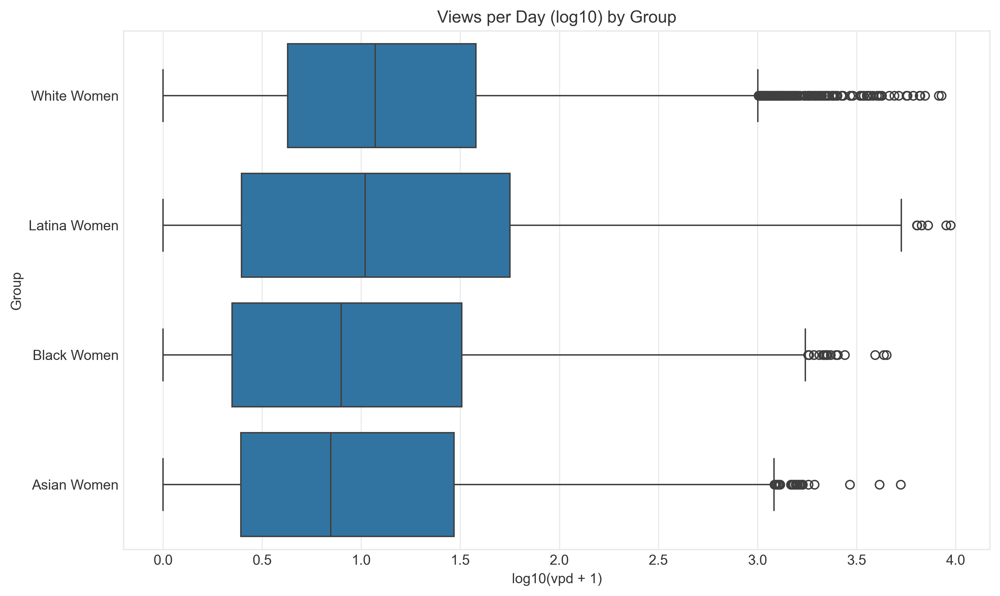
</picture>

| Group | Mean views/day | Median views/day |
|:------|---------------:|-----------------:|
| White Women | **4.26** | **11** |
| Black Women | 3.46 | 7 |
| Latina Women | 3.44 | 9 |
| Asian Women | 3.43 | 6 |

*Source: `outputs/data/02_eda_views_disparities_stats.csv`, `outputs/data/02_eda_views_per_day_by_group.csv`*

White Women receive 23% more views per day on average. The median gap is larger: White Women's median is 57% higher than Asian Women's. This engagement premium compounds over a video's lifetime — a gap that exists from day 1 widens as the platform's recommendation system amplifies early engagement signals.

### 1.5 Linguistic harm: racial identity in the metadata infrastructure

<picture>
  <source media="(prefers-color-scheme: dark)" srcset="../outputs/figures/pmi/03_pmi_associations_bar_dark.png">
  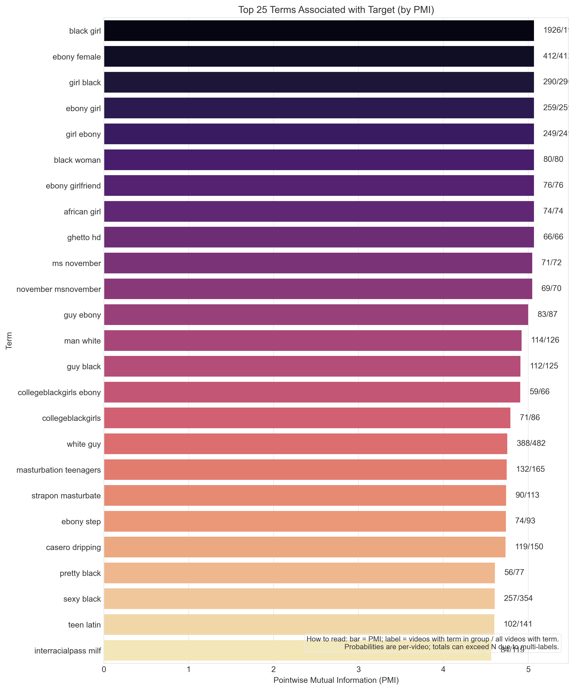
</picture>

PMI analysis of tag co-occurrence reveals that racial identity is encoded almost exclusively through user-submitted tags, not platform-assigned categories. Every racial-identity tag for Black Women hits the **PMI ceiling of 5.07**:

| Tag | PMI | Videos |
|:----|----:|-------:|
| black girl | 5.07 | 1,926 |
| ebony female | 5.07 | 412 |
| girl black | 5.07 | 290 |
| ebony girl | 5.07 | 259 |
| ghetto hd | 5.07 | 66 |

*Source: `outputs/data/03_pmi_intersectional_black_women.csv`*

The ceiling value means these tags are perfectly predictive — they appear exclusively in Black Women content and nowhere else. This has a precise technical implication: any model that uses these tags as features cannot remove the group signal without removing task-relevant signal. Harm is embedded in the infrastructure, not just the model.

### 1.6 Category task validation (Step 07a)

Before modelling, 12 candidate positive-class definitions were tested. Amateur was the correct choice:

<picture>
  <source media="(prefers-color-scheme: dark)" srcset="../outputs/figures/models/07a_category_sweep_dark.png">
  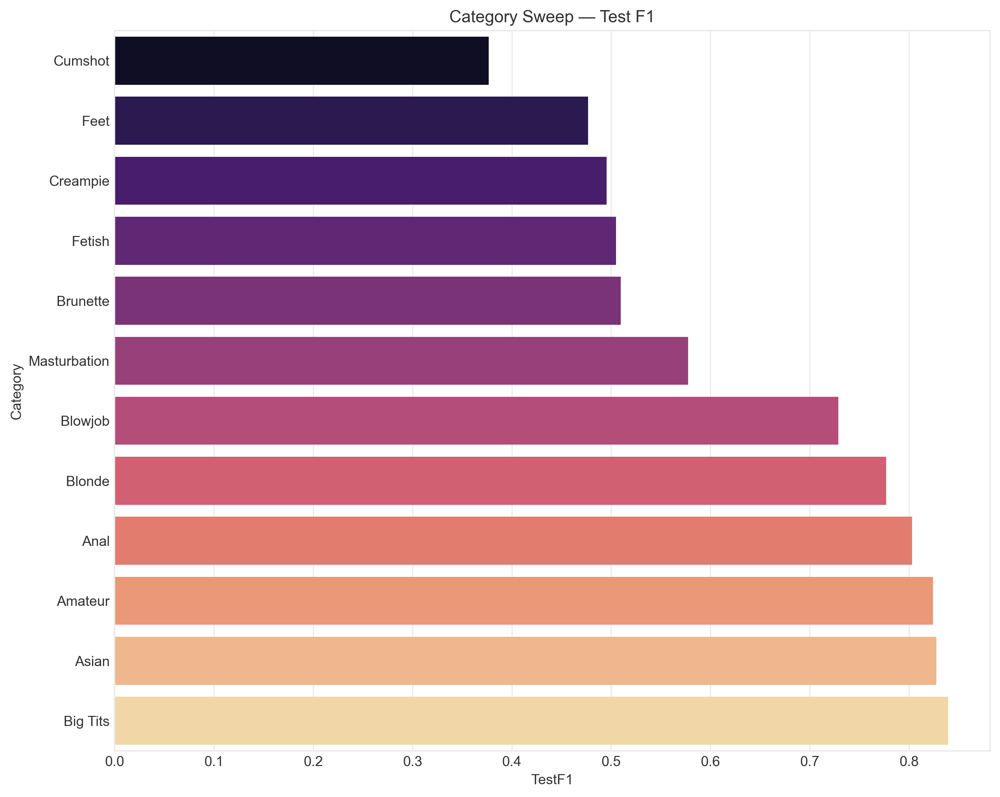
</picture>

| Category | Test F1 | Test AUROC | Prevalence |
|:---------|--------:|-----------:|-----------:|
| **Amateur** | **0.824** | **0.957** | 28.4% |
| Big Tits | 0.840 | 0.977 | 22.3% |
| Blonde | 0.777 | 0.978 | 9.0% |
| Blowjob | 0.729 | 0.963 | 10.8% |
| Cumshot | 0.377 | 0.952 | 1.1% |

*Source: `outputs/data/07a_category_sweep_results.csv`*

Amateur and Big Tits are the only learnable tasks with F1 > 0.80. Amateur was chosen because it maps directly to the platform's economic stratification (independent vs studio creators), and its demographic skew (54–77% Verified Amateur across racialised groups) makes it the natural lens for intersectional fairness analysis. Big Tits is a physical-attribute category with no clear economic mechanism.

---

## 2. Baseline Model Bias — RQ2

> *Can ML models accurately predict categories, and do they exhibit biases?*

### 2.1 Random Forest baseline

**Model:** HashingVectorizer (2-gram, 2¹⁸ features) → TruncatedSVD (256 components) → RandomForestClassifier (500 trees, seed 95), trained on `model_input_text` (title + tags) + `duration` + `ratings`.

**Overall performance (test set, N=107,048):**

| Split | Accuracy | Precision | Recall | F1 |
|:------|--------:|----------:|-------:|---:|
| Val | 0.881 | 0.869 | 0.682 | 0.764 |
| Test | **0.878** | 0.862 | 0.677 | **0.758** |

*Source: `outputs/data/07_overall_metrics.csv`*

**Per-group performance — where accuracy hides the harm:**

| Group | N | Accuracy | Recall | F1 | EOD |
|:------|--:|--------:|-------:|---:|----:|
| White Women | 5,754 | 0.917 | **0.758** | 0.842 | — |
| Asian Women | 3,039 | 0.876 | 0.649 | 0.740 | 0.109 |
| Black Women | 3,193 | 0.844 | **0.562** | 0.686 | **0.196** |
| Latina Women | 2,814 | 0.810 | **0.558** | 0.664 | **0.200** |

*Source: `outputs/data/07_fairness_group_metrics.csv`, `outputs/data/07_fairness_disparities.csv`*

The headline accuracy of 87.8% conceals that **one in three Black Women videos that should be classified as Amateur is instead missed**. Black Women's recall (0.562) is 19.6 percentage-points below White Women's (0.758). This is the Equal Opportunity Difference: the gap in True Positive Rates. At scale — 15,966 Black Women videos, daily platform updates — this is a systematic suppression of content discoverability.

<picture>
  <source media="(prefers-color-scheme: dark)" srcset="../outputs/figures/models/07_margins_baseline_dark.png">
  
</picture>

*Decision margin distribution (Test set). The bimodal structure shows strong confidence at both extremes — the model is not uncertain, it is systematically wrong for specific groups. Source: `src/models/07_rf_baseline.py`*

### 2.2 DistilBERT baseline

**Model:** `distilbert-base-uncased` fine-tuned for 2 epochs (MPS/Apple Silicon, ~2.5 hrs), batch 16, lr=default, seed 95. Input: `model_input_text`.

| Split | Accuracy | F1 |
|:------|--------:|---:|
| Val | 0.927 | 0.873 |
| Test | **0.924** | **0.868** |

**BERT per-group (test):**

| Group | Recall | EOD |
|:------|-------:|----:|
| White Women | 0.941 | — |
| Black Women | 0.861 | **0.080** (−59% vs RF) |
| Asian Women | 0.814 | 0.127 |
| Latina Women | 0.758 | 0.183 |

*Source: `outputs/data/09_fairness_group_metrics.csv`*

BERT substantially closes the Black Women gap (EOD 0.196→0.080) through richer semantic representations. Latina Women remain the hardest group (EOD 0.183) — the vocabulary entanglement between Latina-coded content and other categories persists even at the text-semantic level. BERT is dominated in Pareto space (see §6), making it unsuitable as a deployment recommendation despite its higher accuracy.

---

## 3. Fairness Evaluation Framework — RQ3

> *How do we quantify and compare biases across systems?*

### 3.1 Metrics

Three complementary metrics, applied identically across all models:

- **EOD (Equal Opportunity Difference):** White Women TPR − Group TPR. Primary metric because the harm is specifically about recall — missed positive content means invisible creators.
- **Accuracy Disparity:** Overall accuracy gap. A softer metric; groups can achieve high accuracy while suffering large recall gaps.
- **Precision Disparity:** White Women precision − Group precision. Monitors over-triggering (false positives imposing noise on minority groups).

### 3.2 AUROC and discrimination vs calibration

<picture>
  <source media="(prefers-color-scheme: dark)" srcset="../outputs/figures/eval/08_roc_dark.png">
  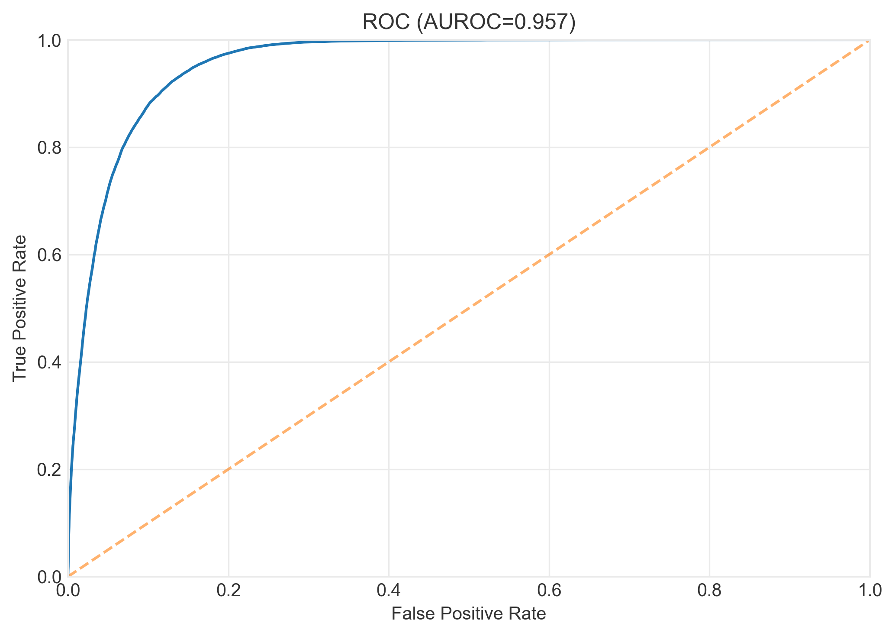
</picture>

**AUROC: 0.957** | **Average Precision: 0.876**

*Source: `outputs/data/08_threshold_sweep.csv`, `outputs/narratives/automated/08_comprehensive_evaluation.md`*

The model is highly discriminative — it can rank Amateur vs non-Amateur videos effectively. The fairness problem is not a learning failure; it is a **calibration and threshold problem**. The model has learned the right signal but applies it unequally across groups.

### 3.3 The threshold is a fairness decision

<picture>
  <source media="(prefers-color-scheme: dark)" srcset="../outputs/figures/eval/08_fairness_curve_dark.png">
  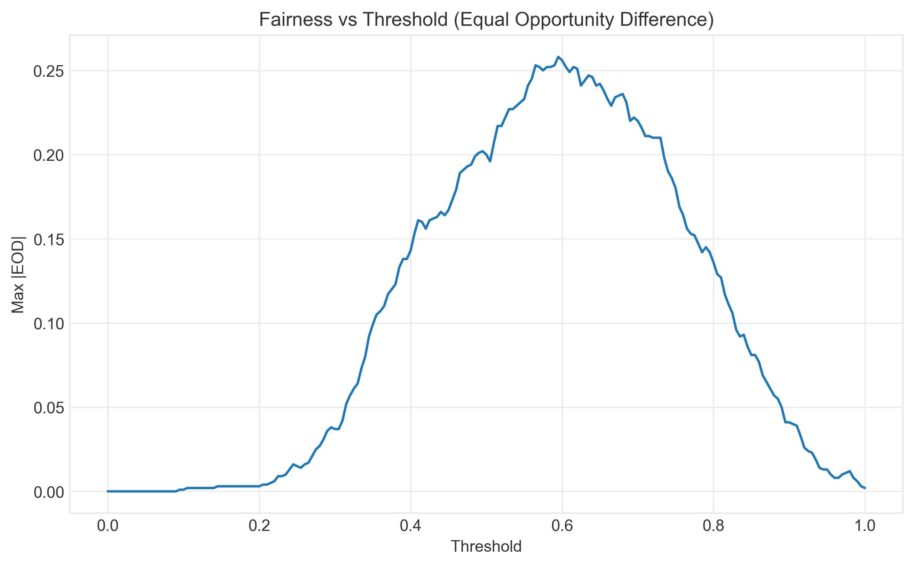
</picture>

*Max |EOD| across all groups as the decision threshold varies. The gap is smallest around 0.35–0.40 — the F1-optimal point. Source: `outputs/data/08_fairness_curve.csv`*

At the F1-optimal threshold of **0.40** (vs default 0.50), Black Women's EOD drops from 0.196 to **0.124** — a **37% reduction with no model changes**.

| Group | EOD at 0.50 | EOD at 0.40 | Improvement |
|:------|------------:|------------:|------------:|
| Black Women | 0.196 | 0.124 | −37% |
| Latina Women | 0.200 | 0.138 | −31% |
| Asian Women | 0.109 | 0.084 | −23% |

*Source: `outputs/data/08_disparities_at_opt.csv`*

Standard practice of deploying at threshold 0.5 is not neutral — it is an active choice that widens the fairness gap relative to the model's natural operating point.

<picture>
  <source media="(prefers-color-scheme: dark)" srcset="../outputs/figures/eval/08_threshold_metrics_dark.png">
  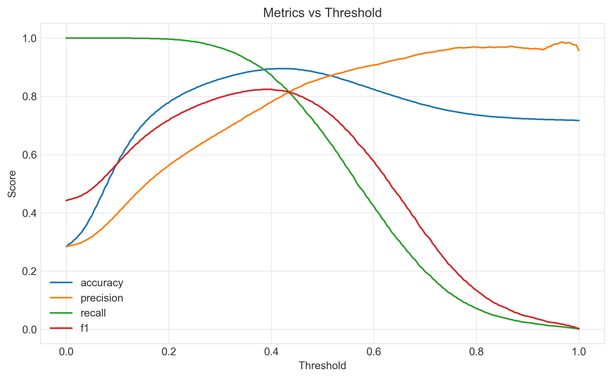
</picture>

<picture>
  <source media="(prefers-color-scheme: dark)" srcset="../outputs/figures/eval/08_confusion_dark.png">
  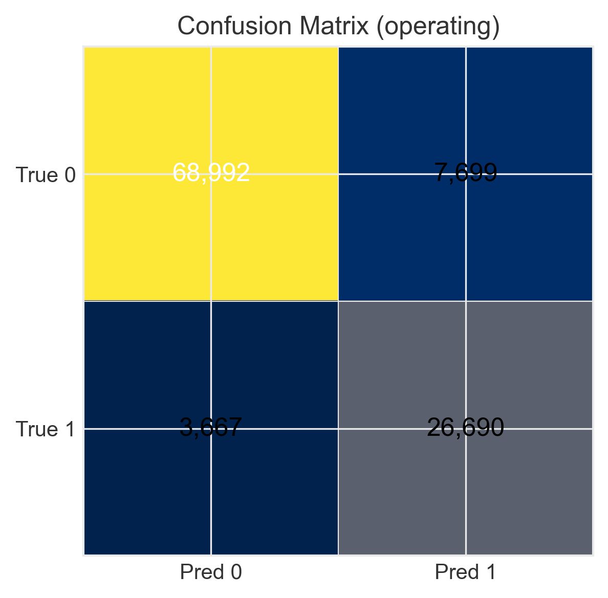
</picture>

*Confusion matrix at threshold 0.40. True_0 = non-Amateur (96,691 videos), True_1 = Amateur (30,357 videos). Source: `outputs/data/08_confusion_matrix_at_opt.csv`*

### 3.4 Statistical significance

<picture>
  <source media="(prefers-color-scheme: dark)" srcset="../outputs/figures/bias/05_bias_forest_views_dark.png">
  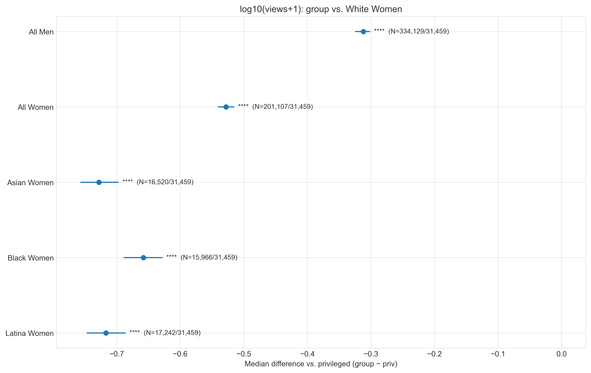
</picture>

<picture>
  <source media="(prefers-color-scheme: dark)" srcset="../outputs/figures/bias/05_bias_forest_ratings_dark.png">
  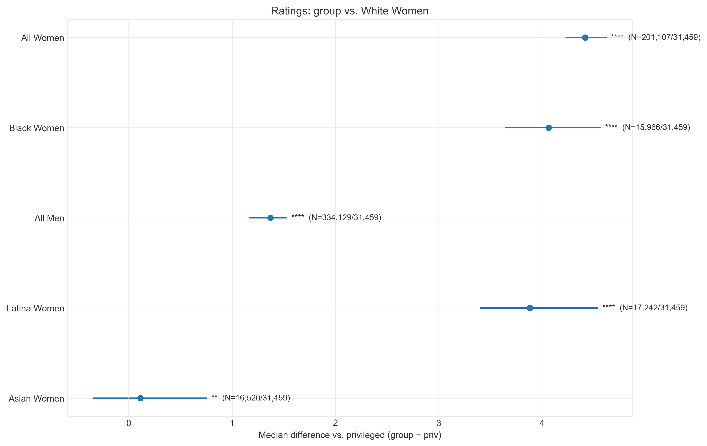
</picture>

*Kruskal-Wallis and Mann-Whitney tests for views and ratings across groups. All pairwise comparisons are statistically significant (p < 0.001 after Bonferroni correction). Source: `outputs/data/05_bias_tests_views.csv`, `outputs/data/05_bias_tests_ratings.csv`*

---

## 4. Mitigation Methods — RQ4

> *What bias mitigation techniques are most effective?*

### 4.1 Pre-processing: Reweighing (Kamiran–Calders 2012)

**What it does.** Before training, each training instance is assigned a weight based on its (group, label) cell:

$$w(a, y) = \frac{P(A=a) \cdot P(Y=y)}{P(A=a, Y=y)}$$

Instances in underrepresented cells (e.g., Black Women × Amateur=1) get weight > 1; overrepresented cells get weight < 1. The RF is trained with `sample_weight=w`. The model architecture, features and hyperparameters are identical to the baseline — only the effective training distribution changes.

**Why it works.** The baseline model was undertrained on minority groups because they were underrepresented. Correcting the weight distribution improves the decision boundary for *all* groups simultaneously — White Women's recall also increases (0.758→0.930).

**Results (test set):**

| Metric | RF Baseline | Reweighing | Change |
|:-------|------------:|-----------:|-------:|
| Accuracy | 0.878 | **0.953** | +7.5pp |
| F1 | 0.758 | **0.915** | +15.7pp |
| Black Women EOD | 0.196 | **0.092** | **−53%** |
| Latina Women EOD | 0.200 | **0.077** | **−61%** |
| Asian Women EOD | 0.109 | 0.099 | −9% |

*Source: `outputs/data/10_reweigh_overall_metrics.csv`, `outputs/data/10_reweigh_disparities.csv`*

**Per-group performance:**

| Group | Recall (Baseline) | Recall (Reweighed) | EOD |
|:------|------------------:|-------------------:|----:|
| White Women | 0.758 | 0.930 | — |
| Black Women | 0.562 | **0.838** | 0.092 |
| Latina Women | 0.558 | **0.853** | 0.077 |
| Asian Women | 0.649 | **0.831** | 0.099 |

*Source: `outputs/data/10_reweigh_group_metrics.csv`*

<picture>
  <source media="(prefers-color-scheme: dark)" srcset="../outputs/figures/10_reweigh_margins_dark.png">
  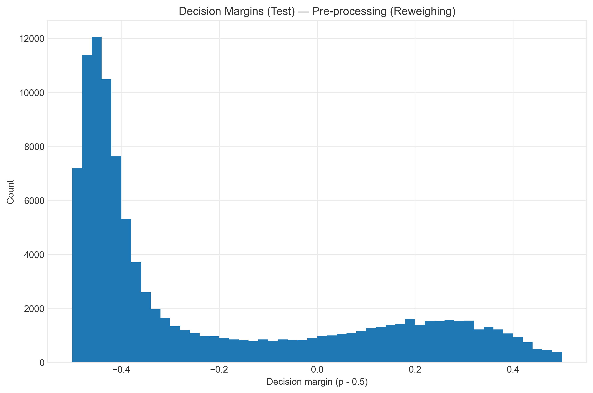
</picture>

**Sensitivity validation (Step 10b — Matched-N).** The matched-N experiment draws equal-sized samples from each group to test whether the improvement is an artefact of the original group-size imbalance. Results are virtually identical: Test acc 0.951, F1 0.912 — confirming the reweighing gain is real and not driven by sample sizes.

*Source: `outputs/data/10b_matchedN_overall_metrics.csv`, `outputs/data/10b_matchedN_group_metrics.csv`*

---

### 4.2 In-processing: Exponentiated Gradient + Demographic Parity (EG + DP)

**What it does.** Fairlearn's `ExponentiatedGradient` wraps a `LogisticRegression` classifier and iteratively adjusts a Lagrange multiplier penalising violations of the **Demographic Parity** (DP) constraint. DP requires equal positive *prediction rates* across groups regardless of the true label:

$$P(\hat{Y}=1 \mid A=a) \approx P(\hat{Y}=1 \mid A=a')$$

**Why the constraint choice matters.** DP is not EOD. DP does not condition on Y=1 — it equalises prediction rates unconditionally. In a dataset where the positive class (Amateur) is semantically entangled with group membership through the vocabulary structure, forcing equal prediction rates does not produce equal true positive rates.

**Results (test set):**

| Metric | RF Baseline | EG + DP |
|:-------|------------:|--------:|
| Accuracy | 0.878 | 0.878 |
| Recall (overall) | 0.677 | **0.914** |
| Precision (overall) | 0.862 | **0.726** |
| Black Women EOD | 0.196 | 0.138 |
| **Latina Women EOD** | **0.200** | **0.297** ⚠️ |

*Source: `outputs/data/11_inproc_overall_metrics.csv`, `outputs/data/11_inproc_disparities.csv`*

<picture>
  <source media="(prefers-color-scheme: dark)" srcset="../outputs/figures/eval/11_inproc_margins_dark.png">
  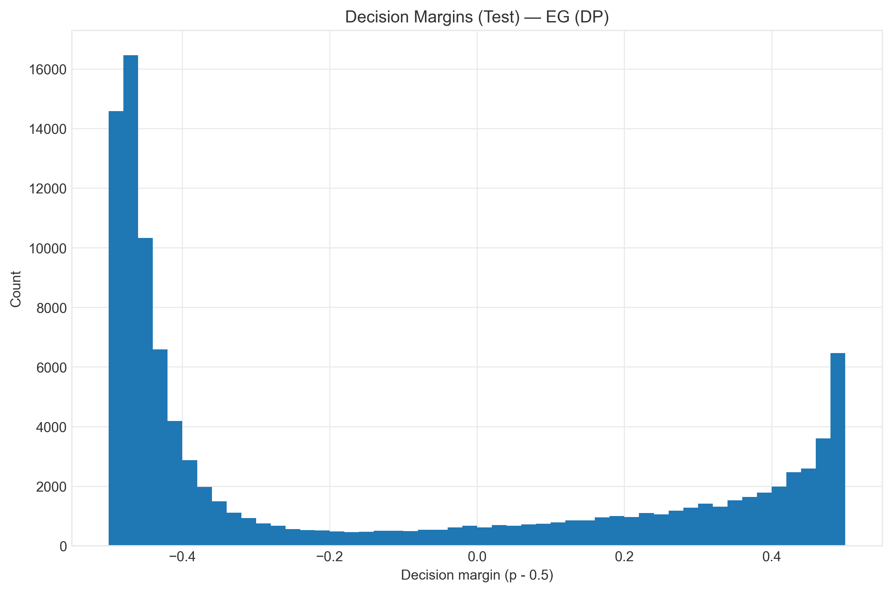
</picture>

**Why Latina Women's EOD worsens.** The DP constraint forces the model to predict positive at the same rate for Latina Women as for White Women. To do this, it must lower the threshold (predict positive more aggressively) for Latina content. But Latina content's vocabulary is heterogeneous — many Latina-positive predictions are false positives. The high-recall, low-precision regime the model enters achieves equal prediction rates but *worse* equal opportunity. The model has solved the stated problem (DP) and failed the unstated one (EOD).

**This is not a tuning failure — it is the wrong objective for this data.** DP is only equivalent to EOD when base rates are equal across groups, which they are not in this corpus (Latina Women have a 31% Amateur positive rate vs 28% for White Women).

---

### 4.3 Post-processing: ThresholdOptimizer (Equalized Odds)

**What it does.** Fairlearn's `ThresholdOptimizer` with **Equalized Odds** constraint. The fitted RF baseline's predicted probabilities are used unchanged — no retraining. On the validation set, a linear programme finds per-group decision thresholds that minimise EOD violation subject to accuracy constraints. Each group receives a different cutoff:

- **White Women:** threshold raised (currently over-classified relative to fairness target)
- **Black / Latina / Asian Women:** threshold lowered (currently under-classified)

**Results (test set):**

| Metric | RF Baseline | ThresholdOpt | Change |
|:-------|------------:|-------------:|-------:|
| Accuracy | 0.878 | 0.839 | −3.9pp |
| F1 | 0.758 | 0.693 | −6.5pp |
| Black Women EOD | 0.196 | **0.008** | **−96%** |
| Latina Women EOD | 0.200 | **0.025** | **−87%** |
| Asian Women EOD | 0.109 | **0.027** | **−75%** |

*Source: `outputs/data/12_postproc_overall_metrics.csv`, `outputs/data/12_postproc_disparities.csv`*

<picture>
  <source media="(prefers-color-scheme: dark)" srcset="../outputs/figures/eval/12_postproc_margins_dark.png">
  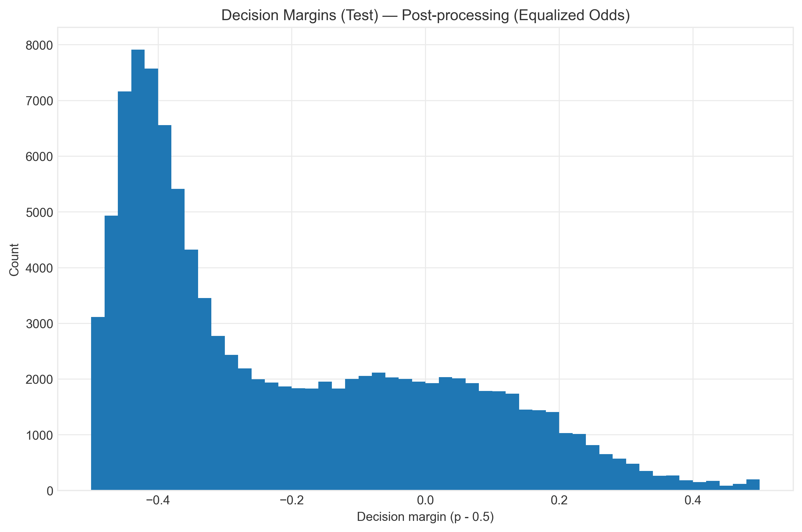
</picture>

**The accuracy cost** (−3.9pp) is the price of the parity guarantee. Latina Women's precision disparity is −0.032 (negative), meaning Latina Women achieve marginally *higher* precision than White Women — a slight over-correction that falls within measurement noise but confirms the optimizer is operating at the boundary of what the RF's probability estimates can support.

**Key insight.** ThresholdOptimizer achieves near-exact parity without retraining. Any deployment that has a fitted model with calibrated probabilities can apply post-processing immediately. The constraint (Equalized Odds) is the right one for this task because it conditions on Y=1 — it directly targets the recall gap that constitutes the economic harm.

---

## 5. Compounding Harms & Causal Evidence — RQ5

> *What are the ethical stakes and societal impacts?*

The harms documented here are not parallel — they compound, operate at different system levels, and have different intervention requirements.

### 5.1 Classification harm (allocative)

<picture>
  <source media="(prefers-color-scheme: dark)" srcset="../outputs/figures/19_bw_effectsizes_dark.png">
  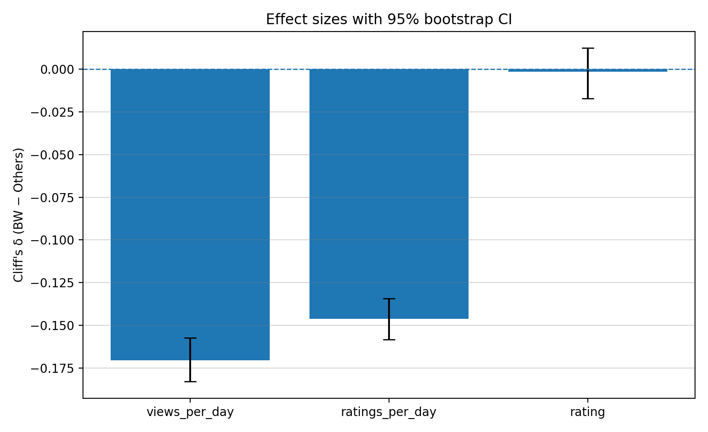
</picture>

Black Women's recall gap (0.196 EOD) means systematic under-surfacing of their content. This is not random noise — it replicates across model types (RF, BERT), across thresholds, and is statistically significant at the scale of 15,966 videos and 3,193 test set instances.

*Source: `outputs/data/19_bw_effect_sizes.csv`*

### 5.2 Structural under-representation in high-visibility content

<picture>
  <source media="(prefers-color-scheme: dark)" srcset="../outputs/figures/17_head_tail_stack_dark.png">
  
</picture>

Black Women are significantly underrepresented in the "Head" — the top 1% of videos by views-per-day. Their share of high-visibility content is disproportionately smaller than their share of the corpus. Content that the classification system fails to label correctly is less likely to be recommended, which suppresses engagement, which keeps it in the Tail.

*Source: `src/analysis/17_engagement_bias_analysis.py`, `outputs/data/17_head_tail_composition.csv`*

### 5.3 Temporal economic harm

<picture>
  <source media="(prefers-color-scheme: dark)" srcset="../outputs/figures/17_gap_rating_dark.png">
  
</picture>

<picture>
  <source media="(prefers-color-scheme: dark)" srcset="../outputs/figures/17_gap_views_per_day_dark.png">
  
</picture>

<picture>
  <source media="(prefers-color-scheme: dark)" srcset="../outputs/figures/19_slope_bw_vs_others_dark.png">
  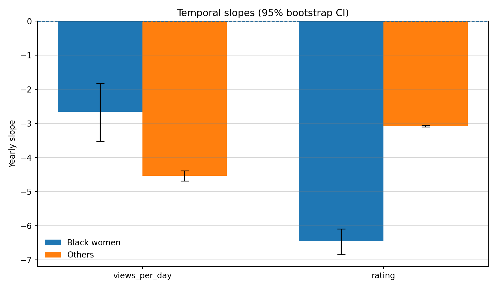
</picture>

Black Women's average ratings are declining **−3.38 rating-points/year faster** than the corpus average:

| Metric | BW slope | Others slope | Gap | 95% CI |
|:-------|--------:|-------------:|----:|-------:|
| Rating | −6.46/yr | −3.08/yr | **−3.38** | [−3.75, −2.98] |
| Views/day | −2.66/yr | −4.53/yr | +1.87 | [+0.98, +2.69] |

*Source: `outputs/data/19_trend_slopes.csv`*

The rating slope gap is entirely negative at 95% confidence — this is a **structural, worsening trend** with no natural reversal mechanism. A model that achieves fairness today will drift toward unfairness over time unless it is regularly retrained on updated data. The views-per-day gap is positive (Black Women declining *less fast* than others) because the absolute view counts are lower — there is less to lose.

<picture>
  <source media="(prefers-color-scheme: dark)" srcset="../outputs/figures/16_temporal_rating_trends_dark.png">
  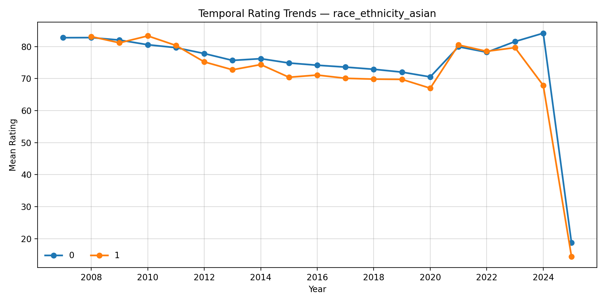
</picture>

*Rating trends over time by group. Source: `outputs/data/16_temporal_rating_view_trends.csv`*

### 5.4 Causal mechanism: the Amateur premium

<picture>
  <source media="(prefers-color-scheme: dark)" srcset="../outputs/figures/causal/30_propensity_by_treatment_dark.png">
  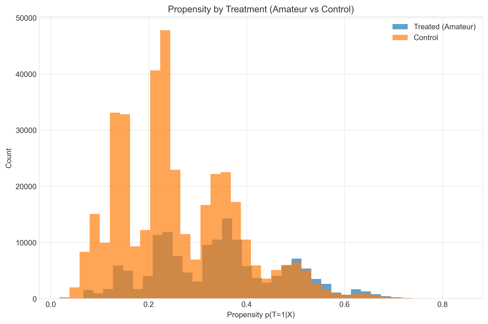
</picture>

<picture>
  <source media="(prefers-color-scheme: dark)" srcset="../outputs/figures/causal/30_weights_hist_dark.png">
  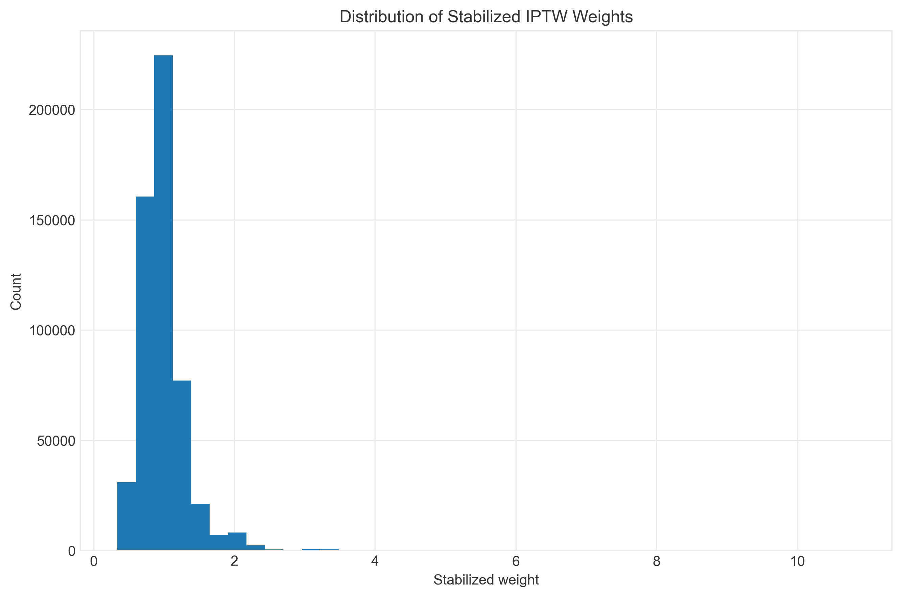
</picture>

IPTW estimation of the causal effect of Amateur classification on rating (N=535,236, covariates: top-20 category dummies + log-duration + log-ratings-count):

| Estimand | ATE | 95% CI | Overlap |
|:---------|----:|-------:|--------:|
| Amateur → Rating | **+7.216** | [7.215, 7.216] | 94.7% |

*Source: `outputs/data/30_ate_rating.csv`, `outputs/data/30_sensitivity.csv`*

Sensitivity analysis across clipping thresholds (0.01, 0.02, 0.05) confirms stability. The 94.7% propensity overlap indicates good positivity — most of the corpus sits in the region where the causal effect is identifiable.

**Interpretation.** Amateur-classified content receives approximately **7.2 rating points more** than otherwise-equivalent non-Amateur content, after adjusting for category co-occurrence and engagement history. The classification system is not just a label: it is an economic signal that redirects a measurable premium. A model that fails to correctly identify Amateur content for Black and Latina Women is — causally — redirecting that premium away from them.

### 5.5 Harm taxonomy

<picture>
  <source media="(prefers-color-scheme: dark)" srcset="../outputs/figures/harm/04_harm_category_heatmap_dark.png">
  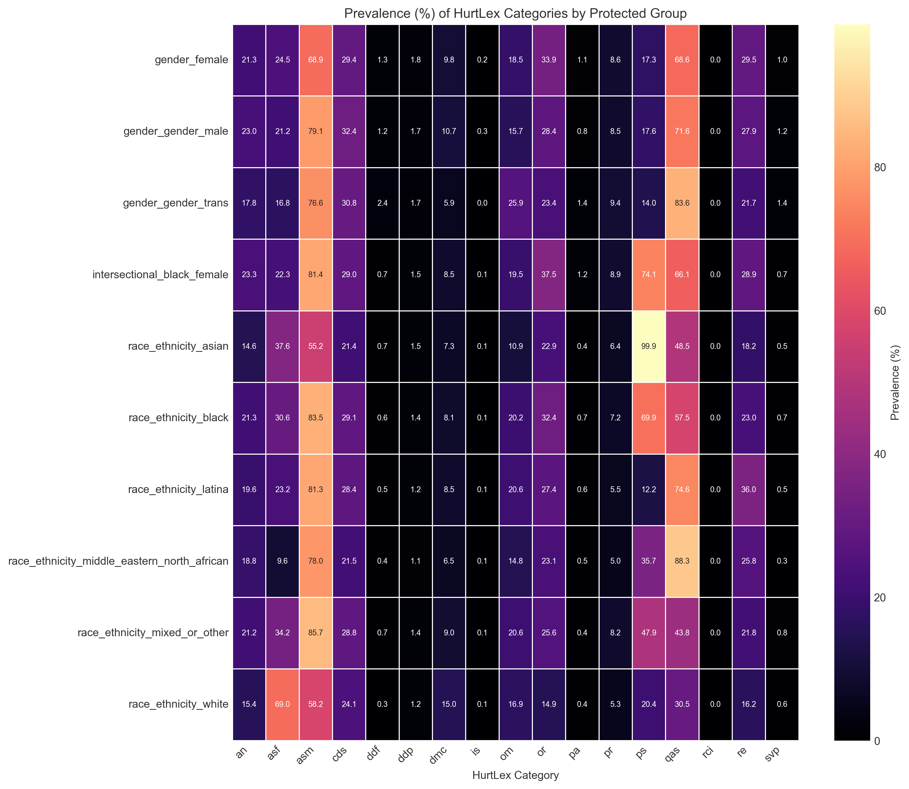
</picture>

*HurtLex harm category mapping across groups. Source: `outputs/data/04_harm_category_by_group.csv`*

| Harm type | Mechanism | Level | Intervention |
|:----------|:----------|:------|:-------------|
| Classification (allocative) | Recall gap → invisible content → lost discoverability | Model | Reweighing, ThresholdOptimizer |
| Temporal-economic | Rating decline −3.38/yr → widening income gap | Platform dynamics | Requires retraining cadence; no existing intervention reverses the trend |
| Linguistic-infrastructure | Racial identity encoded in user tags → unfalsifiable signal | Metadata architecture | Cannot be addressed by model-level interventions |

Model-level fairness interventions are **necessary but not sufficient**. The linguistic and temporal harms operate upstream of any classification decision.

---

## 6. Synthesis: The Pareto Frontier

<picture>
  <source media="(prefers-color-scheme: dark)" srcset="../outputs/figures/dark/25_pareto_frontier_dark.png">
  
</picture>

*Each point is a strategy evaluated on two objectives: accuracy (x-axis) and fairness score = 1 − max|EOD| (y-axis). The frontier line connects non-dominated strategies. Source: `outputs/data/25_pareto_points.csv`*

| Strategy | Accuracy | Fairness (1−max EOD) | Pareto | Notes |
|:---------|--------:|--------------------:|:------:|:------|
| RF Postproc | 0.839 | **0.968** | ✅ | Near-exact parity; −3.9pp accuracy cost |
| RF Reweighed | **0.953** | 0.901 | ✅ | Best accuracy; −53% Black EOD |
| BERT | 0.924 | 0.817 | ❌ | Dominated by Reweighing on both axes |
| RF Baseline | 0.878 | 0.800 | ❌ | Dominated |
| EG + DP | 0.878 | 0.703 | ❌ | **Worst fairness despite explicit constraint** |

*Source: `outputs/data/25_pareto_points.csv`, `outputs/data/mitigation_effectiveness.csv`*

**Two and only two strategies are non-dominated:**

1. **Reweighing** — choose this when accuracy matters and retraining is feasible. It improves accuracy for all groups simultaneously and is validated as robust to sample-size artefacts (10b).

2. **ThresholdOptimizer** — choose this under a regulatory parity mandate, when retraining is not possible, or when the policy requirement is that recall rates must fall within a defined tolerance. The 3.9pp accuracy cost buys a near-exact parity guarantee.

**EG + DP is actively harmful** — it achieves neither good accuracy nor good fairness and is dominated on both dimensions. It is the clearest demonstration that the choice of fairness constraint (DP vs EOD) is not a technical detail: it is the primary determinant of whether an intervention works.

---

## 7. Where the Research Goes Next

### 7.1 Multi-platform auditing at scale

This pipeline was designed to be portable. The same methodology — corpus construction, lexicon-based intersectional group inference, fairness metric suite, Pareto analysis — can be applied to any platform that exposes metadata. Immediate targets:

- **OnlyFans / Fansly**: creator-platform fee structures; demographic distribution of subscription income
- **MindGeek portfolio (PornHub, YouPorn, RedTube cross-platform)**: compare algorithmic structures across owned platforms
- **YouTube / TikTok**: the same Amateur/professional pipeline segregation exists; racial gaps in monetisation eligibility have been documented but not formally audited with this framework

The key bottleneck is data access, not methodology. The Redtube API is unusually open. For other platforms, researcher access agreements or platform cooperation would be required.

### 7.2 Longitudinal fairness — beyond a snapshot

The slope gap finding (−3.38 rating-points/year) reveals a gap the current framework cannot close: a model that is fair today will drift toward unfairness if the underlying platform dynamics continue. Future work should:

- **Define temporal fairness metrics**: fairness evaluated not at a point in time but across a model's deployment lifetime
- **Design retraining schedules** informed by the expected drift rate — the slope gap provides a principled basis for estimating how quickly a fair model becomes unfair
- **Develop early-warning monitors**: track group-level EOD monthly and trigger retraining when EOD exceeds a defined threshold (e.g., 0.15)

### 7.3 Moving beyond inferred attributes

All group labels in this corpus are inferred from user-submitted metadata, not self-reported. This creates two problems:

1. **Circularity**: the model learns racial categories from the same metadata it is supposed to classify — the inference and the target are not independent
2. **Creator-identity mismatch**: a video tagged "ebony" may or may not be produced by a Black creator; the metadata describes the platform's categorisation, not the creator's identity

Future work should explore:
- **Privacy-preserving self-identification systems**: opt-in demographic disclosure with strong anonymisation guarantees
- **Disaggregated inference error analysis**: measuring how often the lexicon-based group assignment is wrong, and what the downstream fairness implications of misclassification are
- **Third-party annotation**: structured human annotation of a gold-standard subset to validate inference quality (the `27_ground_truth.py` template is already built into this pipeline)

### 7.4 Debiasing at the metadata layer

The linguistic harm is embedded in the tag infrastructure. Model-level interventions cannot address it. Several upstream approaches merit investigation:

- **Tag vocabulary debiasing**: modify the tag recommendation system to reduce the correlation between racial-identity tags and platform engagement signals
- **Category reassignment audits**: systematically review whether racialised content is being assigned to categories that carry structural disadvantages (lower search ranking, different monetisation tiers)
- **Platform-level natural experiments**: the introduction of a new category or tagging policy creates a quasi-experimental setting for measuring causal effects of metadata changes

### 7.5 Multi-label fairness

The positive-class definition (Amateur vs not) imposes a binary frame on a multi-label corpus. A video can be Amateur AND Asian AND Blonde simultaneously. Standard fairness metrics evaluate single-label tasks. Future work should:

- **Develop multi-label EOD**: extend equal opportunity metrics to settings where the positive class is not exclusive
- **Study label co-occurrence bias**: whether protected-group videos are disproportionately assigned to lower-engagement label combinations
- **Model the label correlation structure**: the category co-occurrence network (step 20) provides the foundation for this analysis

<picture>
  <source media="(prefers-color-scheme: dark)" srcset="../outputs/figures/20_top_strength_dark.png">
  
</picture>

*Hub categories in the co-occurrence network. Fairness interventions targeting these 20 hubs would have disproportionately large impact. Source: `outputs/data/20_category_centrality.csv`*

### 7.6 Regulatory framework development

No current algorithmic accountability framework mandates intersectional fairness auditing for adult content platforms. The EU AI Act (2024) covers hiring, credit, education — not content classification. The DSA imposes transparency obligations but does not specify fairness metrics. The UK Online Safety Act addresses illegal content and child safety.

The audit methodology developed in this dissertation is a candidate for regulatory standardisation:

- **Audit components**: corpus construction protocol, group inference validation, fairness metric suite (EOD, accuracy disparity, precision disparity), Pareto evaluation
- **Reporting requirements**: group-level performance tables, temporal trend monitoring, intervention comparison
- **Trigger thresholds**: the 10b matched-N sensitivity check provides a methodology for validating that reported improvements are real

Translating this into a regulatory standard requires engagement with platform operators, creator advocacy groups, and policymakers — all of whom currently have no agreed-upon metric for what "fair" means in this context.

### 7.7 Creator-centred economic evaluation

Current metrics measure model performance, not creator income. The IPTW analysis bridges this gap partially (the Amateur premium is a measurable economic quantity), but future work should:

- **Link classification errors to income proxies**: use platform API data to estimate the monetisation impact of missed Amateur labels at the creator level
- **Study creator retention**: does systematic mislabelling cause creators to leave the platform? Are exit rates higher for racialised groups?
- **Measure the compounding effect**: the three harm types (classification, temporal, linguistic) operate simultaneously — what is the joint economic impact over a 3-year creator career?

### 7.8 Adversarial robustness of fair models

The group priority fix revealed that model behaviour is sensitive to how groups are defined. Fair models trained under one grouping scheme may behave differently under another. Future work should:

- **Stress-test the group definition**: what happens to reweighing's fairness guarantees when group inference errors are 5%, 10%, 20%?
- **Evaluate distributional shift**: the corpus is a snapshot; platform content evolves. How quickly do the calibrated thresholds (ThresholdOptimizer) become miscalibrated as the distribution shifts?
- **Study platform-adaptive gaming**: if creators learn that certain tags improve classification outcomes, does the tag distribution shift in ways that re-introduce bias?

---

## Evidence Index

| Finding | Source file |
|:--------|:------------|
| Corpus composition | `outputs/data/06_stratify_key_distribution.csv` |
| Verified Amateur by group | `outputs/data/02_eda_quality_proxies_by_group.csv` |
| Views per day by group | `outputs/data/02_eda_views_disparities_stats.csv` |
| PMI tag associations | `outputs/data/03_pmi_intersectional_black_women.csv` |
| Category sweep | `outputs/data/07a_category_sweep_results.csv` |
| RF baseline per-group | `outputs/data/07_fairness_group_metrics.csv` |
| RF baseline disparities | `outputs/data/07_fairness_disparities.csv` |
| BERT per-group | `outputs/data/09_fairness_group_metrics.csv` |
| AUROC / threshold sweep | `outputs/data/08_threshold_sweep.csv` |
| Fairness curve | `outputs/data/08_fairness_curve.csv` |
| Reweighing results | `outputs/data/10_reweigh_group_metrics.csv`, `10_reweigh_overall_metrics.csv` |
| Matched-N validation | `outputs/data/10b_matchedN_group_metrics.csv` |
| EG + DP results | `outputs/data/11_inproc_group_metrics.csv` |
| ThresholdOptimizer results | `outputs/data/12_postproc_group_metrics.csv` |
| Mitigation effectiveness | `outputs/data/mitigation_effectiveness.csv` |
| Pareto frontier | `outputs/data/25_pareto_points.csv` |
| Temporal slope gap | `outputs/data/19_trend_slopes.csv` |
| IPTW causal ATE | `outputs/data/30_ate_rating.csv` |
| Harm heatmap | `outputs/data/04_harm_category_by_group.csv` |
| Network centrality | `outputs/data/20_category_centrality.csv` |

---

*All pipeline code is in `src/`. To reproduce any result, run the corresponding numbered step per `REBUILD_PLAN.md`. Seed 95 is fixed across all stochastic operations.*
